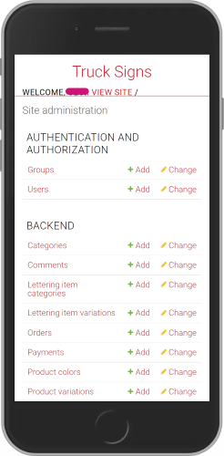

<div align="center">

# Signs for Trucks

   


</div>

## Table of Contents

- [About This Repository](#about-this-repository)
- [Prerequisites](#prerequisites)
- [Quickstart](#quickstart)
  - [How to Build the Image](#how-to-build-the-image)
- [Usage](#usage)
  - [Configuration](#configuration)
  - [Building and Publishing the Image](#building-and-publishing-the-image)
  - [Running with docker run](#running-with-docker-run)
  - [Data Persistence](#data-persistence)
  - [Common Commands](#common-commands)
- [CI/CD Pipeline](#cicd-pipeline)
- [API and Admin](#api-and-admin)
- [Screenshots](#screenshots)
- [Further Reading](#further-reading)

## About This Repository

**Signs for Trucks** is an online store for pre-designed vinyls with custom letterings. This
repository holds the **Truck Signs API** - the Django/DRF backend and admin panel - together with
everything needed to run it as a container.

The image is built by GitHub Actions and published to the GitHub Container Registry. The Compose
stack **pulls** that image; nothing is built on the deployment host. Only the backend publishes a
port (8020); PostgreSQL is reachable only inside the Compose network.

| Path | Description |
| --- | --- |
| `Dockerfile` | Builds the backend image: `python:3.12-slim`, dependencies, unprivileged user, entrypoint. |
| `docker-compose.yml` | The stack: `backend` (pulled from GHCR) and `db` (PostgreSQL), one network, three named volumes. |
| `entrypoint.sh` | Waits for PostgreSQL, migrates, collects static files, ensures the admin account, starts Gunicorn. |
| `example.env` | Template for `.env`. Copy it; never commit the real one. |
| `requirements.txt` | Pinned Python dependencies. |
| `pyproject.toml` | Config for `black`, `isort` and `flake8`. |
| `Procfile` | Legacy Heroku process definition. Unused by the container setup. |
| `.dockerignore` | Keeps git metadata, docs and `.env` out of the image. |
| `.gitattributes` | Forces LF endings for shell scripts - a CRLF shebang breaks the container. |
| `.github/workflows/` | Build, test and PR-check pipelines. See [CI/CD Pipeline](#cicd-pipeline). |
| `docs/testing.md` | Linter and test setup. |
| `src/` | The Django project: `manage.py`, `tsa_app` (settings, URLs, WSGI), `tsa_products` (models, views, tests). |

## Prerequisites

* [Docker Engine](https://docs.docker.com/engine/install/) with the Compose v2 plugin
* [Git](https://git-scm.com/downloads)
* Python 3.12 - only for local development without Docker

## Quickstart

```bash
git clone https://github.com/CookieCrack3r/truck-sign.git
cd truck-sign

cp example.env .env      # then fill in the placeholders
docker compose up -d
docker compose logs -f backend
```

`SECRET_KEY` and `DB_PASSWORD` are required - Compose refuses to start without them. Generate a
key with `openssl rand -base64 48`.

The API is then served on **port 8020**:

| URL | |
| --- | --- |
| `http://<host>:8020/admin/` | Django admin panel |
| `http://<host>:8020/truck-signs/products/` | Product API |

Stop with `docker compose down` (keeps data) or `docker compose down -v` (deletes it).

### How to Build the Image

Only needed when you change the application or the `Dockerfile` - otherwise the image is pulled.

```bash
# arbitrary local tag
docker build -t truck-sign:local .

# under the name the Compose file expects, so `docker compose up` uses your build
docker build -t ghcr.io/cookiecrack3r/truck-sign:v1.0.0 .
```

## Usage

### Configuration

All configuration comes from environment variables, read from the `.env` file next to
`docker-compose.yml`. Nothing sensitive is stored in the repository.

`docker-compose.yml` uses two forms: `${VAR:-default}` is optional, `${VAR:?message}` is required
and aborts with that message if unset - rather than silently starting with an insecure default.

| Variable | Default | Description |
| --- | --- | --- |
| `SECRET_KEY` | **required** | Django signing key. Unique per deployment. |
| `DB_PASSWORD` | **required** | PostgreSQL password, used by both services. |
| `MODE` | `prod` | `prod` selects PostgreSQL, anything else SQLite. |
| `DEBUG_ENABLED` | `False` | Never `True` on a public host. |
| `LOG_LEVEL` | `ERROR` | Django log level. |
| `ALLOWED_HOSTS` | `localhost,127.0.0.1` | Comma separated. Add your server address, otherwise Django answers `400`. |
| `CORS_ALLOWED_ORIGINS` | `http://localhost:3000` | Origins allowed to call the API. |
| `DB_NAME` / `DB_USER` | `trucksigns_db` / `trucksigns_user` | Database name and user. |
| `BACKEND_PORT` | `8020` | Host port. Change it here, not the container port `8000`. |
| `IMAGE_TAG` | `v1.0.0` | Image tag to deploy. Use `main` for the latest default-branch build. |
| `GUNICORN_WORKERS` | `4` | Worker processes. |
| `DB_WAIT_RETRIES` / `DB_WAIT_INTERVAL` | `30` / `2` | Database wait loop in the entrypoint. |
| `DJANGO_SUPERUSER_USERNAME` / `_EMAIL` / `_PASSWORD` | empty | When username and password are set, the entrypoint creates this admin account on first start and skips it on every later start. |
| `CLOUD_NAME` / `CLOUD_API_KEY` / `CLOUD_API_SECRET` | empty | Optional Cloudinary storage. Empty means local media volume. |

Also worth changing in `docker-compose.yml`: the image path if you forked the repository, and
`postgres:17-alpine` if you need another major version - an existing data volume cannot be read by
a newer major version.

### Building and Publishing the Image

The `Dockerfile` is based on `python:3.12-slim`, pinned to a minor version for reproducible
builds. `requirements.txt` is installed before the application code so the dependency layer is
cached. The container runs as an unprivileged user (`UID 10001`), the final `WORKDIR` is
`/app/src`, and `EXPOSE 8000` documents Gunicorn's port inside the container - the host port is
mapped by Compose.

Publishing manually (normally done by CI):

```bash
echo "<your-github-token>" | docker login ghcr.io -u <your-github-username> --password-stdin
docker build -t ghcr.io/<your-github-username>/truck-sign:v1.0.0 .
docker push ghcr.io/<your-github-username>/truck-sign:v1.0.0
```

### Running with docker run

Compose is the intended way; this is the equivalent by hand. Replace every `<placeholder>` and
**never put real credentials into a command you commit or share**.

```bash
docker network create tsa-network

docker run -d \
  --name tsa_db \
  --network tsa-network \
  --restart unless-stopped \
  -e POSTGRES_DB='<your-database-name>' \
  -e POSTGRES_USER='<your-database-user>' \
  -e POSTGRES_PASSWORD='<your-database-password>' \
  -v postgres_data:/var/lib/postgresql/data \
  postgres:17-alpine

docker run -d \
  --name tsa_backend \
  --network tsa-network \
  --restart unless-stopped \
  -p 8020:8000 \
  -e SECRET_KEY='<your-django-secret-key>' \
  -e ALLOWED_HOSTS='localhost,127.0.0.1,<your-server-address>' \
  -e DB_NAME='<your-database-name>' \
  -e DB_USER='<your-database-user>' \
  -e DB_PASSWORD='<your-database-password>' \
  -e DB_HOST='tsa_db' \
  -e DJANGO_SUPERUSER_USERNAME='<your-admin-username>' \
  -e DJANGO_SUPERUSER_PASSWORD='<your-admin-password>' \
  -v static_files:/app/src/staticfiles \
  -v media_files:/app/src/mediafiles \
  ghcr.io/cookiecrack3r/truck-sign:v1.0.0
```

Secrets on the command line end up in the shell history and in `docker inspect`. Prefer
`--env-file .env` instead of the individual `-e` flags.

### Data Persistence

Three named volumes, managed by Docker rather than bound to a host directory, so no permanent
link exists from the host into the container:

| Volume | Mounted at |
| --- | --- |
| `postgres_data` | `/var/lib/postgresql/data` |
| `static_files` | `/app/src/staticfiles` |
| `media_files` | `/app/src/mediafiles` |

They survive `docker compose down` and a host reboot. Only `docker compose down -v` deletes them.

### Common Commands

```bash
docker compose pull                  # fetch the tag named in .env
docker compose logs -f backend       # follow the log
docker compose ps                    # status and published ports
docker compose exec backend python manage.py createsuperuser
docker compose exec db pg_dump -U <user> <database> > backup.sql
```

Common problems: `DB_PASSWORD must be set in .env` means the `.env` is missing; a `400` on every
URL means the host is not in `ALLOWED_HOSTS`; `manifest unknown` on pull means the GHCR package is
private or the tag does not exist.

## CI/CD Pipeline

| Workflow | Trigger | What it does |
| --- | --- | --- |
| `build.yaml` | push to `main`, any tag, manual | Builds the image and pushes it to GHCR. Needs `packages: write`; `docker/metadata-action` derives the tags and lowercases the image name, which GHCR requires. |
| `test.yaml` | push/PR on `main` touching Python files | `flake8`, `black --check`, `isort --check-only`, then the Django test suite with `MODE=dev` (SQLite, no database service needed). |
| `check-open-pr.yaml` | push to any branch except `main` | Fails if the branch has no open pull request. |

The image `build.yaml` publishes is exactly what `docker-compose.yml` pulls - which is why the
Compose file has no `build` context. After the first push, set the GHCR package to **public**,
otherwise every deployment host needs `docker login ghcr.io`.

## API and Admin

All API routes live under `/truck-signs/`, the admin panel under `/admin/`. The route at `/`
renders an intentionally empty layout template - the shop frontend is a separate project.

| Endpoint | |
| --- | --- |
| `/truck-signs/products/` | List products |
| `/truck-signs/categories/` | List categories |
| `/truck-signs/product-detail/<id>/` | Single product |
| `/truck-signs/product-color/` | Available colors |
| `/truck-signs/order/<id>/create/` | Create an order |

The full list is in `src/tsa_products/urls.py`. Most views are DRF generic class based views;
order creation and customer image upload use `GenericAPIView` because they combine several steps.

> [!NOTE]
> To create truck vinyls with truck logos, first create the __Category__ Truck Sign, then the
> __Product__. The frontend only fetches products of that category.

## Screenshots

<div align="center">




</div>

## Further Reading

- [Docker documentation](https://docs.docker.com/) and the [Compose file reference](https://docs.docker.com/reference/compose-file/)
- [GitHub Container Registry](https://docs.github.com/en/packages/working-with-a-github-packages-registry/working-with-the-container-registry)
- [Django documentation](https://docs.djangoproject.com/en/5.2/) and the [deployment checklist](https://docs.djangoproject.com/en/5.2/howto/deployment/checklist/)
- [Django REST Framework](https://www.django-rest-framework.org/)
- [Testing setup in this repository](./docs/testing.md)
